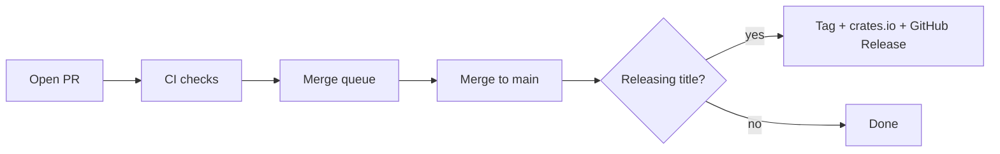

This page is for people changing the **arcane-sdk** repo (not for game integration — see [Quickstart](/quickstart)).

## How the repo works

- **`main` is protected.** Every change goes through a pull request and the **merge queue**. There are no direct pushes to `main`, and CI never commits onto `main`.
- **You bump the crate version in the PR** when the title is a releasing change (`feat` / `fix` / `perf` / breaking).
- **On merge**, CI reads `Cargo.toml`, creates tag `vX.Y.Z`, publishes to crates.io, and opens a GitHub Release (with `include/arcane_sdk.h`). Non-releasing titles skip that.



## Pull request checklist

1. Use a [Conventional Commits](https://www.conventionalcommits.org/) **PR title** (validated by CI).
2. If the title releases, bump **`Cargo.toml`** (and `Cargo.lock`) to the expected SemVer.
3. Keep `include/arcane_sdk.h` in sync if you change `src/ffi.rs`.
4. Rebase onto `main` when the queue says you are behind — then fix the version if another releasing PR landed first.

### SemVer vs title

| PR title | What you do to `Cargo.toml` |
|---|---|
| `feat: …` / `feat(scope): …` | minor bump |
| `fix: …` / `perf: …` | patch bump |
| `feat!: …` / `fix(api)!: …` | major bump |
| `chore:` / `docs:` / `ci:` / `test:` / `refactor:` / `build:` / `revert:` | leave version unchanged |

```bash
# From the repo root — bumps Cargo.toml + Cargo.lock to match the title
.github/scripts/bump-version.sh "feat: add ownership ticket verification"
```

CI runs the same rules via `.github/scripts/check-version-bump.sh`. A releasing PR with the wrong version fails. A non-releasing PR that touches the version also fails.

## Parallel PRs and the merge queue

Several `feat` PRs can all target the next minor while `main` is still on the old version. That is fine until one merges.

After another releasing PR lands:

1. Rebase (or merge) `main` into your branch — the queue requires an up-to-date branch.
2. Run `bump-version.sh` again with **your** PR title so `Cargo.toml` matches the new base.
3. Push and let checks re-run, then re-enter the queue.

Example: `main` is `0.1.0`. PR A and PR B both bump to `0.2.0`. A merges first → tag `v0.2.0`. B rebases and bumps to `0.3.0`.

## C header

If you change the FFI in `src/ffi.rs`, regenerate the committed header (cbindgen **0.29.4**):

```bash
cargo install cbindgen --version 0.29.4 --locked
.github/scripts/generate-header.sh
```

CI verifies the header is up to date. The release job does not install cbindgen.

## Local docs preview

From `documentation/`:

```bash
bunx mint dev
```

## What maintainers configure once

Documented for operators (GitHub **Settings**):

- Ruleset on `main`: PR + merge queue, require branch up to date, signed commits optional
- Required checks: conventional title, version bump, CI (check + C header)
- Allow Actions to create tags `v*` (not commits on `main`)
- Secrets: `CARGO_REGISTRY_TOKEN` (crates.io); optional `RELEASE_TOKEN` if the default token cannot create tags/releases
